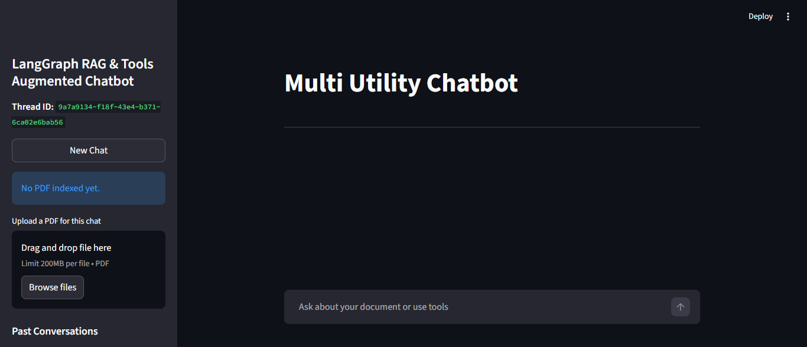

# 🚀 LangGraph RAG & Tools Augmented Chatbot

A multi-utility AI chatbot built with:

- FastAPI (Backend API)
- Streamlit (Frontend UI)
- LangGraph (Agent Workflow)
- Groq LLM
- FAISS (Vector Store)
- PDF RAG
- Crypto Price Tool
- DuckDuckGo Search Tool

---
# 🚀 AI Chatbot (FastAPI + Streamlit) UI
<p align="center">
  
</p>
## 📦 Features

- Chat with memory (thread-based)
- Upload PDF and ask questions (RAG)
- Real-time crypto price lookup
- Web search integration
- Multi-thread conversation support
- Automatic Streamlit UI launch from FastAPI

---

## 🛠 Installation

### 1️⃣ Clone the repository

```bash
git clone https://github.com/MeerAli1472/Tools-Augmented-Chatbot-Using-Langraph.git
cd to repo
=================================
Create virtual environment

========================================
pip install -r requirements.txt

=================================
Add your keys in dontenv file
===================================
GROQ_API_KEY=your_key_here
HF_TOKEN=your_token_here

================================
Run the project:
uvicorn api:app --reload

=======================================
Then open:
http://127.0.0.1:8000/chat

